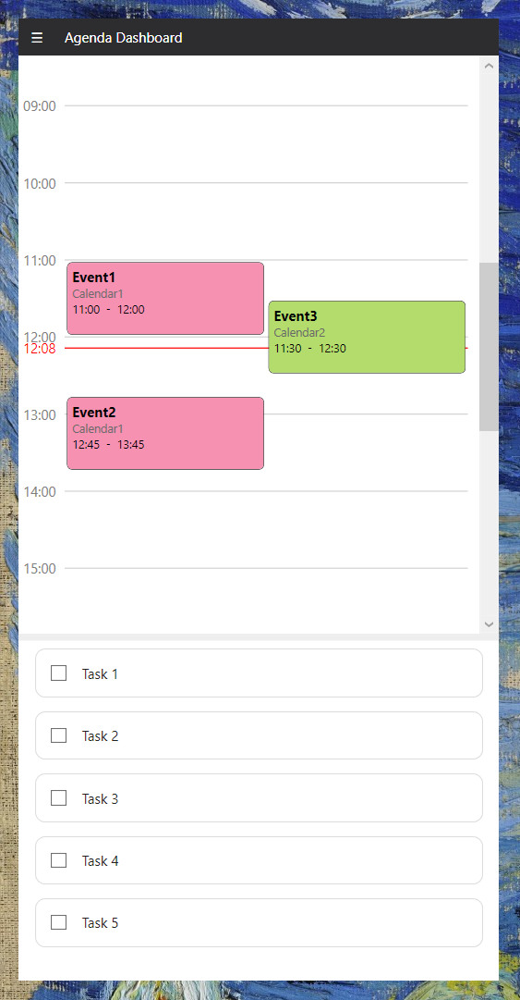

# Agenda Dashboard

A lightweight desktop widget that displays your daily schedule and tasks directly on your desktop background. Stay organized without switching between apps by keeping your Google Calendar events and Todoist tasks always visible.

## Features

- **Google Calendar and Todoist Integration**: See today's events from Google Calendar and today's tasks from Todoist.
- **Auto-Refresh**: Configure refresh intervals to keep your data up-to-date.

## Screenshots



## Requirements

- Windows 10 or later
- .NET Framework 4.7.2 or higher
- Google Calendar account
- Todoist account

## Installation

### Option 1: Download Release
1. Go to the [Releases](../../releases) page.
2. Download the latest `AgendaDashboard.exe`.
3. Run the executable - no installation required!

### Option 2: Build from Source
1. Clone the repository:
   ```bash
   git clone https://github.com/armnrd/agenda-dashboard.git
   cd agenda-aashboard
   ```

2. Open the solution in Visual Studio 2019 or later.

3. Restore NuGet packages and build the solution.

## Configuration

1. **Google Calendar API Setup**:
   - Go to the [Google Cloud Console](https://console.cloud.google.com/).
   - Create a new project or select an existing one.
   - Enable the Google Calendar API.
   - Create credentials (OAuth 2.0 Client ID).
   - Download the credentials JSON file and save it as `gcal_credentials.json` in the same directory as the executable.

2. **Todoist API Setup**:
   - Go to [Todoist App Management](https://todoist.com/app_console).
   - Create a new app to get your API token.
   - Copy your API token and save it in a file named `todoist_credentials.json` in the same directory as the executable. It should look like this:
   ```json
   {
     "api_token": "your_todoist_api_token_here"
   }
   ```

3. **Application Configuration**

The application uses a `settings.json` file for configuration.

```json
{
  "theme": "light",
  "position": {
    "x": 20,
    "y": 20 
  },
  "todoist": {
    "refresh-interval": 60
  },
  "google-calendar": {
    "refresh-interval": 300,
    "ignored-ids": [
      "calendar-id-1@group.calendar.google.com",
      "calendar-id-2@import.calendar.google.com"
    ]
  }
}
```

### Configuration Options

- **theme**: widget theme (`"light"` or `"dark"`)
- **position**: widget placement on desktop
  - **x**: horizontal position in pixels from left edge
  - **y**: vertical position in pixels from top edge
- **todoist**: Todoist-specific settings
  - **refresh-interval**: how often to fetch tasks (in seconds)
- **google-calendar**: Google Calendar-specific settings
  - **refresh-interval**: how often to fetch events (in seconds)
  - **ignored-ids**: array of calendar IDs to exclude from display

### Finding Calendar IDs

To find calendar IDs for the `ignored-ids` array:
1. Go to [Google Calendar](https://calendar.google.com).
2. Click the three dots next to a calendar name.
3. Select "Settings and sharing".
4. Scroll down to find the "Calendar ID" section.

## Usage

Once configured, the widget will:
- display today's calendar events with times,
- show today's Todoist tasks with priority indicators,
- automatically refresh based on your configured interval, and
- always remain visible on your desktop background.

## API Usage

This application uses:
- **Google Calendar API v3**: for fetching calendar events
- **Todoist REST API v2**: for retrieving tasks and projects

All API calls are made with proper authentication and respect rate limits.

## License

This project is licensed under the MIT License - see the [LICENSE](LICENSE) file for details.

---

**⭐ If you find this project useful, please consider giving it a star!**